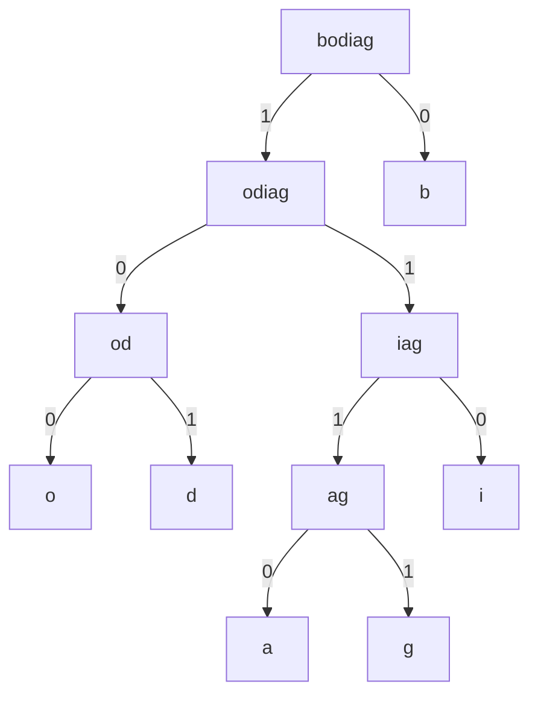

# Examples of DEFLATE (LZ77 and Huffman Encoding)
## LZ77
The following string can be encoding with LZ77 as follows:
"ABBAAABBBB"
[0, 0, "A"] # The first A (A)
[0, 0, "B"] # The first B (AB)
[1, 1, "A"] # Duplicate the previous B and add an A (ABBA)
[1, 2, "B"] # Duplicate the previous A and the recently added A and add B (ABBAAAB)
[1, 3, -] # Dpublicate the previous B, the recently added B, and the next recently added B. We are finished (ABBAAABBBB)

## Huffman encoding
The following string can be encoded with Huffman encoding as follows:
big bad bob [ignore the spaces]

Frequency chart:
b: 4
i: 1
g: 1
a: 1
d: 1
o: 1

This generates the following tree:

By following this tree you can determine the bits assigned to each character:
b: 0
i: 110
g: 1111
a: 1110
d: 101
o: 100

With 6 characters, we could encode this (without Huffman encoding) with 3 bit for each character. This results in 9*3=27 bits. Using the Humman encoding, we get (b)4*1+(i)1*3+(g)1*4+(a)1*4+(d)1*3+(o)1*3=4+3+4+4+3+3=21 bits.

