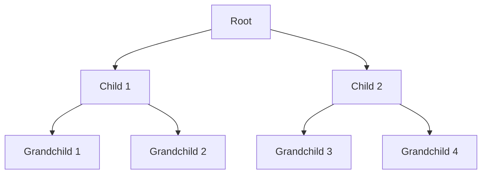

# Examples of DEFLATE (LZ77 and Huffman Encoding)
## LZ77
The following string can be encoding with LZ77 as follows:
"ABBAAABBBB"
[0, 0, "A"] # The first A (A)
[0, 0, "B"] # The first B (AB)
[1, 1, "A"] # Duplicate the previous B and add an A (ABBA)
[1, 2, "B"] # Duplicate the previous A and the recently added A and add B (ABBAAAB)
[1, 3, -] # Dpublicate the previous B, the recently added B, and the next recently added B. We are finished (ABBAAABBBB)

## Huffman encoding
The following string can be encoded with Huffman encoding as follows:
big bad bob

Frequency chart:
B: 4
i: 1
g: 1
a: 1
d: 1
o: 1

